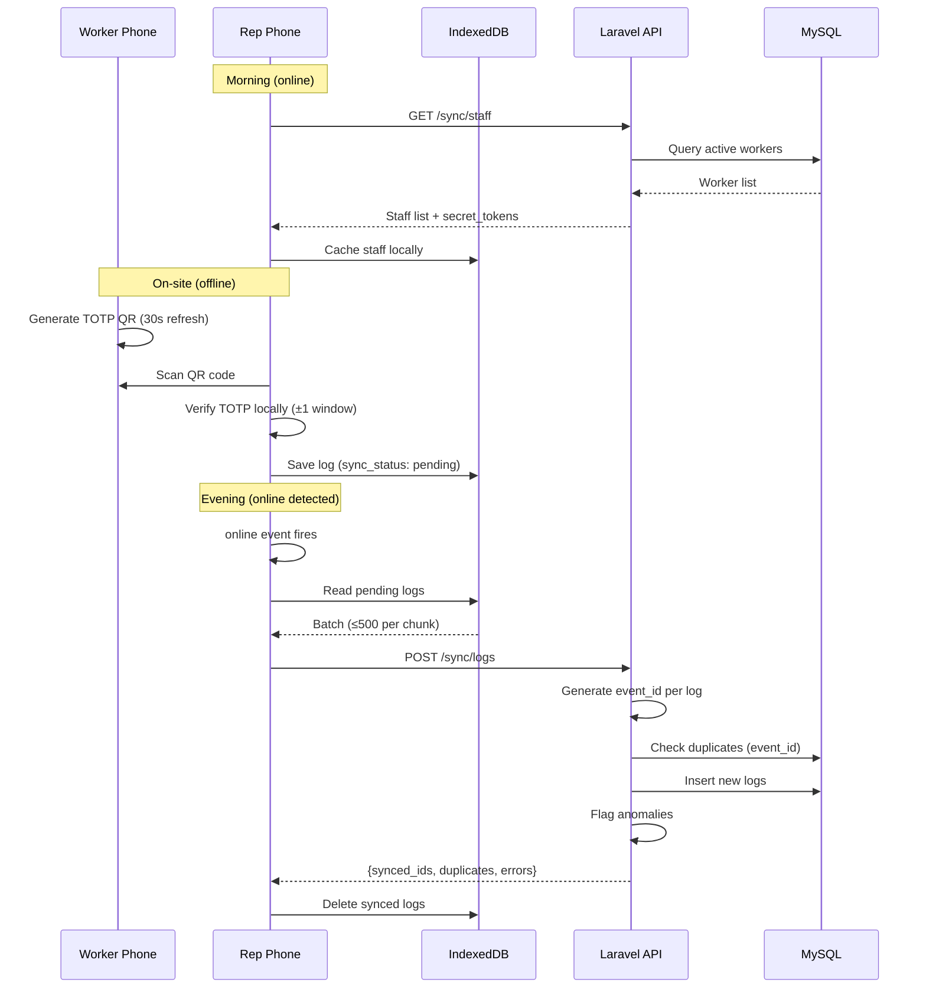
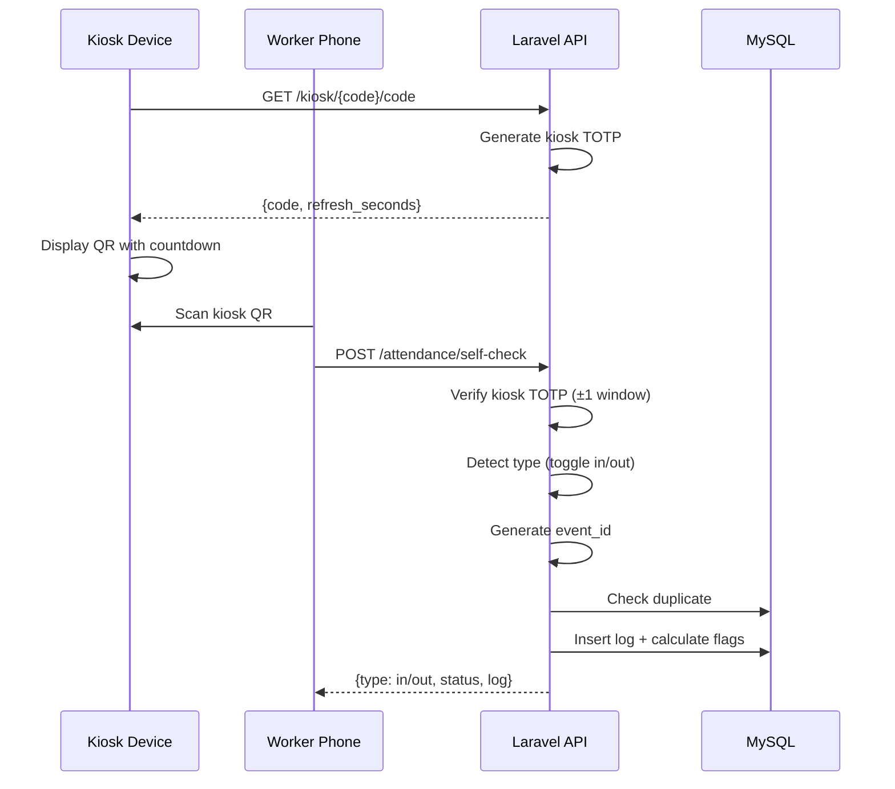
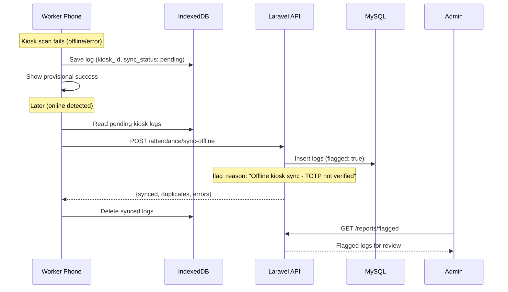

# System Design: VerifyStaff

## 1. Purpose & Scope

**Problem:** Traditional attendance tracking relies on expensive biometric hardware and stable internet connections. Many work environments (construction sites, field operations, remote locations) lack both.

**Goals:**
- Reliable attendance tracking that works offline
- Idempotent sync mechanism that guarantees no duplicate or lost records
- Full auditability of every scan, sync, and configuration change
- Minimal hardware requirements (any smartphone with a browser)
- Fraud-resistant QR codes with short-lived TOTP validity

**Non-goals:** Payroll processing, biometric verification, facial recognition, real-time GPS enforcement, multi-tenant architecture, hardware integration (NFC, turnstiles).

---

## 2. High-Level Architecture

```
┌─────────────────────────────────────────────────────────────┐
│                        CLIENT LAYER                         │
│                                                             │
│  ┌──────────────┐  ┌──────────────┐  ┌──────────────┐      │
│  │  Worker PWA  │  │   Rep PWA    │  │  Kiosk PWA   │      │
│  │  (QR display │  │  (QR scanner │  │  (QR display │      │
│  │   + kiosk    │  │   + offline  │  │   for fixed  │      │
│  │   scanner)   │  │   capture)   │  │   devices)   │      │
│  └──────┬───────┘  └──────┬───────┘  └──────┬───────┘      │
│         │                 │                  │              │
│         └────────┬────────┴──────────────────┘              │
│                  │                                          │
│         ┌────────▼────────┐                                 │
│         │    IndexedDB    │  ← Dexie.js outbox              │
│         │  (pendingLogs   │    Persists across sessions     │
│         │   + staff)      │    Survives app restarts        │
│         └────────┬────────┘                                 │
└──────────────────┼──────────────────────────────────────────┘
                   │
          online ──┼── offline (queued locally)
                   │
┌──────────────────▼──────────────────────────────────────────┐
│                       SERVER LAYER                          │
│                                                             │
│  ┌─────────────────────────────────────────────────┐        │
│  │              Nginx (reverse proxy)              │        │
│  └───────────────────────┬─────────────────────────┘        │
│                          │                                  │
│  ┌───────────────────────▼─────────────────────────┐        │
│  │            Laravel API (PHP-FPM)                │        │
│  │                                                 │        │
│  │  Controllers → FormRequests → Services          │        │
│  │                     ↓                           │        │
│  │              API Resources → JSON               │        │
│  └──────┬──────────────┬───────────────┬───────────┘        │
│         │              │               │                    │
│  ┌──────▼──────┐ ┌─────▼─────┐ ┌──────▼──────┐             │
│  │   MySQL 8   │ │  Queue    │ │  Scheduler  │             │
│  │             │ │  Worker   │ │  (cron)     │             │
│  │  - users    │ │           │ │             │             │
│  │  - logs     │ │  - mail   │ │  - daily    │             │
│  │  - kiosks   │ │  - jobs   │ │  - weekly   │             │
│  │  - settings │ │           │ │  - monthly  │             │
│  │  - summaries│ │           │ │  - dirty/15m│             │
│  └─────────────┘ └───────────┘ └─────────────┘             │
└─────────────────────────────────────────────────────────────┘
```

**Docker Compose services:** app (PHP 8.4-FPM), nginx (port 8000), db (MySQL 8.0), queue (queue:work), scheduler (schedule:work).

---

## 3. Core Data Flows

### 3.1 Representative Mode (Offline Capture → Sync)



### 3.2 Kiosk Mode (Online Self-Check)



### 3.3 Kiosk Offline Fallback (Unverified)



---

## 4. Offline Sync Design

This is the core reliability mechanism of the system.

### 4.1 IndexedDB Outbox

```
Database: VerifyStaffDB (Dexie.js)

┌─────────────────────────────────────────────┐
│ pendingLogs                                 │
├─────────────────────────────────────────────┤
│ ++id (auto-increment)                       │
│ event_id      → SHA256 hash (unique)        │
│ worker_id     → target worker               │
│ rep_id        → null for kiosk logs         │
│ kiosk_id      → null for rep logs           │
│ type          → 'in' | 'out'                │
│ device_time   → ISO 8601 from device clock  │
│ device_timezone → e.g. 'Europe/Istanbul'    │
│ sync_status   → pending | syncing | failed  │
│ sync_attempt  → retry count                 │
│ scanned_totp  → captured code (optional)    │
│ latitude/longitude → GPS at scan time       │
├─────────────────────────────────────────────┤
│ Indexes: event_id, worker_id, type,         │
│          device_time, sync_status            │
└─────────────────────────────────────────────┘

┌─────────────────────────────────────────────┐
│ staff (cached for offline verification)     │
├─────────────────────────────────────────────┤
│ id, name, employee_id, secret_token, status │
└─────────────────────────────────────────────┘
```

### 4.2 Sync Strategy

| Aspect | Implementation |
|--------|---------------|
| **Chunk size** | 500 logs per batch |
| **Trigger** | `window.addEventListener('online', ...)` |
| **Concurrency** | Mutex flag (`syncInProgress`) prevents parallel syncs |
| **Log routing** | Rep logs → `POST /sync/logs`, Kiosk logs → `POST /attendance/sync-offline` |
| **Success** | Synced logs deleted from IndexedDB |
| **Failure** | Logs remain in IndexedDB with `sync_status: failed` |
| **Role check** | Rep/admin syncs rep logs, workers sync kiosk logs |
| **Backoff** | None (retries on next online event or manual trigger) |

### 4.3 Idempotency: Event ID

Every attendance event is uniquely identified by a deterministic hash:

```
event_id = SHA256(worker_id + rep_id + device_timestamp + scan_type)
```

- Generated **client-side** before saving to IndexedDB
- Verified **server-side** before database insert
- `event_id` column has a **UNIQUE index** in MySQL
- Duplicate uploads return the existing record (not an error to the batch)

### 4.4 Conflict Resolution Rules

| Conflict | Resolution |
|----------|------------|
| Duplicate event_id | Silently skip, add to `duplicates` response array |
| Same worker, same minute, different reps | Keep both, flag for admin review |
| Check-in without prior check-out | Auto-flag as "missing checkout" |
| Check-out without prior check-in | Flag as anomaly |
| Offline kiosk log | Accept but flag as "TOTP not verified" |
| Future timestamp (> server time + tolerance) | Accept but flag as "Future timestamp detected" |

---

## 5. Security Model

### 5.1 TOTP (Time-based One-Time Password)

| Parameter | Value |
|-----------|-------|
| Algorithm | SHA1 (RFC 6238 via Google2FA) |
| Digits | 6 |
| Time step | 30 seconds (configurable 15-60 for kiosks) |
| Verification window | ±1 step for real-time (90 seconds effective validity) |
| Offline window | ±2 steps for offline verification (150 seconds effective validity) |

**Secret derivation:** Each user/kiosk has a `secret_token`. The TOTP secret is derived deterministically:
```
raw = SHA256(secret_token)  → 32 bytes
base32_secret = base32_encode(raw[:10])  → 16 character base32 string
```

This means no separate TOTP secret storage — it's derived from the existing token.

### 5.2 Replay Prevention

- QR codes expire every 30 seconds (new TOTP code)
- Visual countdown timer signals "live" code (screenshot deterrent)
- ±1 window tolerance balances usability vs. security
- Server-side event_id deduplication prevents replaying the same scan

### 5.3 Authentication

| Aspect | Implementation |
|--------|---------------|
| Mechanism | Laravel Sanctum Personal Access Tokens (Bearer) |
| Token type | Opaque database-backed tokens (not JWT) |
| Token expiry | None by default (revoked on logout) |
| Worker sessions | Single-device: all previous tokens deleted on login |
| Admin/Rep sessions | Multi-device: tokens accumulate until logout |
| Token refresh | `POST /auth/refresh` (old token deleted, new one issued) |

### 5.4 Threat Summary

| Threat | Mitigation |
|--------|------------|
| QR screenshot replay | 30s TOTP expiry + event_id deduplication |
| Clock manipulation | Server time is authoritative; `GET /time` for sync |
| Token theft | Single-device enforcement for workers; revoke on logout |
| Offline data tampering | Server-side validation after sync; flagged logs for review |
| GPS spoofing | GPS is audit-only, not enforcement. Anomaly detection for impossible travel patterns. |
| Brute-force login | Laravel's built-in rate limiting |

---

## 6. Authorization & Roles

| Role | Access |
|------|--------|
| **Admin** | All endpoints. User/department/kiosk/settings management. All reports. Dashboard. |
| **Representative** | Sync staff list, upload logs, view dashboard, view reports. Cannot manage users/settings. |
| **Worker** | Generate own TOTP code, self-check (kiosk mode), view own status. Cannot access admin endpoints. |

**Enforcement:** Authorization logic lives in FormRequest classes (`authorize()` method) and inline controller checks. No separate Policy classes — kept simple given 3 fixed roles.

```
Public endpoints (no auth):
  POST /auth/login
  GET  /time
  POST /invite/validate
  POST /invite/accept
  GET  /kiosk/{code}/code

Protected endpoints (auth:sanctum):
  All other routes — role checked per-endpoint
```

---

## 7. Data Model (Core Entities)

```
┌──────────┐       ┌─────────────────┐       ┌──────────┐
│  users   │       │ attendance_logs │       │  kiosks  │
├──────────┤       ├─────────────────┤       ├──────────┤
│ id       │◄──┐   │ id              │   ┌──►│ id       │
│ name     │   │   │ event_id (uniq) │   │   │ name     │
│ email    │   ├───│ worker_id (FK)  │   │   │ code     │
│ role     │   │   │ rep_id (FK)     │───┘   │ secret_  │
│ secret_  │   │   │ kiosk_id        │       │   token  │
│   token  │   │   │ type (in/out)   │       │ status   │
│ status   │   │   │ device_time     │       └──────────┘
│ dept_id  │───┤   │ sync_status     │
│ invite_  │   │   │ flagged         │       ┌──────────┐
│   token  │   │   │ flag_reason     │       │ settings │
│ deleted_ │   │   │ work_minutes    │       ├──────────┤
│   at     │   │   │ is_late         │       │ key      │
└──────────┘   │   │ is_overtime     │       │ group    │
               │   │ latitude/lng    │       │ value    │
┌──────────┐   │   │ paired_log_id   │       │ type     │
│  depts   │   │   └─────────────────┘       └──────────┘
├──────────┤   │
│ id       │   │   ┌─────────────────┐
│ name     │   │   │ work_summaries  │
│ desc     │   │   ├─────────────────┤
└──────────┘   └───│ worker_id (FK)  │
                   │ period_type     │
                   │ period_start    │
                   │ total_minutes   │
                   │ overtime_minutes│
                   │ late_arrivals   │
                   │ is_dirty        │
                   └─────────────────┘
```

**Critical fields on `attendance_logs`:**
- `event_id` — SHA256 hash, UNIQUE index, idempotency key
- `rep_id` / `kiosk_id` — source indicator (mutually exclusive: rep XOR kiosk)
- `device_time` — recorded from scanning device (may differ from server time)
- `sync_status` — tracks processing state
- `flagged` + `flag_reason` — anomaly tracking for admin review

---
## 8. Work Summary Lifecycle

Work summaries are stored in `work_summaries` as a derived, cached projection.
The source of truth remains `attendance_logs`.

Summaries can be created/recalculated via three mechanisms:

### 1) Scheduled Precomputation (Batch)
A scheduler triggers the `summaries:calculate` command to precompute summaries for all active workers:
- daily / weekly / monthly / yearly runs at scheduled times
- `--dirty-only` mode recalculates only summaries marked `is_dirty = true`

### 2) Targeted Async Recalculation (Queue Job)
When a single worker/period needs recalculation, the system dispatches `CalculateWorkSummary`:
- Unique per `(worker_id, period_type, date)` to prevent duplicate queued jobs
- Processes weekly/monthly/yearly summaries asynchronously

### 3) On-Demand Fallback (Lazy Compute)
When an API report is requested and the summary is missing, `ReportService` calculates it immediately:
- `getWeeklySummary() / getMonthlySummary() / getYearlySummary()`
- Ensures the API can always respond even if scheduled jobs have not run yet

### Consistency Rule
- `attendance_logs` is authoritative
- `work_summaries` is a cache
- Dirty flagging is used to invalidate summaries when logs change
## 9. Background Processing

### 9.1 Queue (Database Driver)

| Job | Trigger | Purpose |
|-----|---------|---------|
| `UserInviteMail` | User creation | Sends invite email asynchronously (ShouldQueue) |
| `CalculateWorkSummary` | On-demand | Recalculates period summaries for a worker |
| `ProcessAttendanceSync` | Batch sync | Processes large sync batches asynchronously |

**Config:** `QUEUE_CONNECTION=database`, worker runs with `--sleep=3 --tries=3 --max-time=3600`.

### 9.2 Scheduler

| Schedule | Command | Purpose |
|----------|---------|---------|
| Daily at 01:00 | `summaries:calculate --period=daily` | Recalculate daily summaries |
| Monday at 02:00 | `summaries:calculate --period=weekly` | Recalculate weekly summaries |
| 1st of month at 03:00 | `summaries:calculate --period=monthly` | Recalculate monthly summaries |
| Every 15 minutes | `summaries:calculate --dirty-only` | Recalculate only dirty summaries |

**Dirty flag mechanism:** When an `AttendanceLog` is created/updated/deleted, the `AttendanceLogObserver` marks related `WorkSummary` records as `is_dirty = true`. The 15-minute scheduler picks up dirty summaries and recalculates them.

---

## 10. Performance & Indexing

### 10.1 Database Indexes

```sql
-- attendance_logs (most queried table)
UNIQUE INDEX (event_id)                    -- idempotency lookups
INDEX (worker_id, device_time)             -- worker history queries
INDEX (worker_id, type, device_time)       -- toggle mode detection
INDEX (rep_id, device_time)                -- rep activity queries
INDEX (sync_status)                        -- pending sync queries
INDEX (kiosk_id)                           -- kiosk log queries

-- work_summaries
UNIQUE INDEX (worker_id, period_type, period_start)  -- one summary per period
INDEX (worker_id, period_type)                       -- worker summaries
INDEX (period_start)                                 -- time-range queries
INDEX (is_dirty)                                     -- dirty recalculation

-- users
UNIQUE INDEX (email)
UNIQUE INDEX (employee_id)  -- where not null
```

### 10.2 Batch Ingestion

- Sync endpoint accepts arrays of logs, processed in a single DB transaction
- Client-side chunking (500 items) prevents HTTP timeouts
- Per-item error tracking: failed items don't block the rest of the batch
- Response includes `synced_ids`, `duplicates`, and `errors` arrays for client-side reconciliation

### 10.3 Summary Precomputation

- Work summaries are precomputed and cached in `work_summaries` table
- Dirty flag prevents unnecessary recalculation
- Reports read from summaries (fast) rather than aggregating raw logs (slow)
- Scheduled recalculation ensures summaries stay fresh

---

## 11. Failure Scenarios & Behavior

| Scenario | System Behavior |
|----------|----------------|
| **Clock drift > 90s** | TOTP verification fails. Worker must manually sync device clock. `GET /time` endpoint provides server time reference. |
| **Duplicate sync** | `event_id` UNIQUE constraint prevents double-insert. Duplicate returned in response for client cleanup. |
| **Partial batch failure** | Transaction processes all items; per-item errors tracked. Successful items synced, failed items returned with error details. Client retains failed logs. |
| **Device reset before sync** | Data loss (accepted risk). IndexedDB survives browser restart but not full device wipe. Mitigation: sync at every connectivity window. |
| **Offline kiosk > 24h** | Workers use offline fallback: logs saved locally, synced later with `flagged: true` and reason "Offline kiosk sync - TOTP not verified". |
| **Server unreachable during sync** | Logs remain in IndexedDB. `online` event listener triggers retry on reconnection. No exponential backoff. |
| **Invite email not delivered** | Admin resends via `POST /users/{id}/resend-invite`. New token generated, old one invalidated. |
| **Worker loses phone mid-shift** | Missing checkout flagged automatically when next day's check-in arrives. Admin resolves via flagged logs review. |
| **Concurrent sync attempts** | Mutex flag (`syncInProgress`) prevents parallel sync operations on the same device. |

---

## 12. Observability

### 12.1 Audit Logging

All significant events are logged via `AuditLogger` to a daily-rotating log file:

| Event Type | Logged Data |
|------------|-------------|
| `attendance` | action (check_in/check_out/updated/deleted), worker_id, performed_by, device_time, flagged |
| `totp` | action (verify), worker_id, success/failure, verified_by |
| `settings` | action (update), key, old_value, new_value, changed_by |
| `auth` | action (login/logout/refresh), user_id, success, IP, user_agent |
| `security` | event description, user_id, IP, user_agent |
| `sync` | action, user_id, stats (synced/failed/duplicates counts) |
| `work_summary` | action, worker_id, period_type, calculation data |

### 12.2 Key Metrics (Derivable from Logs)

| Metric | Source |
|--------|--------|
| Sync success/failure rate | `sync` audit entries |
| Average sync delay | `device_time` vs `sync_time` delta in attendance_logs |
| Flagged log count | `SELECT COUNT(*) FROM attendance_logs WHERE flagged = true` |
| Pending sync queue | IndexedDB `pendingLogs` count (client-side) |
| TOTP verification failure rate | `totp` audit entries where `success = false` |
| Late arrival rate | `SELECT COUNT(*) FROM attendance_logs WHERE is_late = true` |

### 12.3 Error Handling

All API errors follow a consistent JSON structure:

```json
{
  "success": false,
  "error": {
    "code": "VALIDATION_ERROR | NOT_FOUND | UNAUTHENTICATED | SERVER_ERROR",
    "message": "Human-readable description",
    "details": {}
  }
}
```

| Error Code | HTTP Status | Trigger |
|------------|-------------|---------|
| `VALIDATION_ERROR` | 422 | FormRequest validation failure |
| `NOT_FOUND` | 404 | Model or route not found |
| `UNAUTHENTICATED` | 401 | Missing or invalid Sanctum token |
| `METHOD_NOT_ALLOWED` | 405 | Wrong HTTP method for route |
| `HTTP_ERROR` | varies | Generic HTTP exceptions |
| `SERVER_ERROR` | 500 | Unhandled exceptions (debug info in dev mode) |
